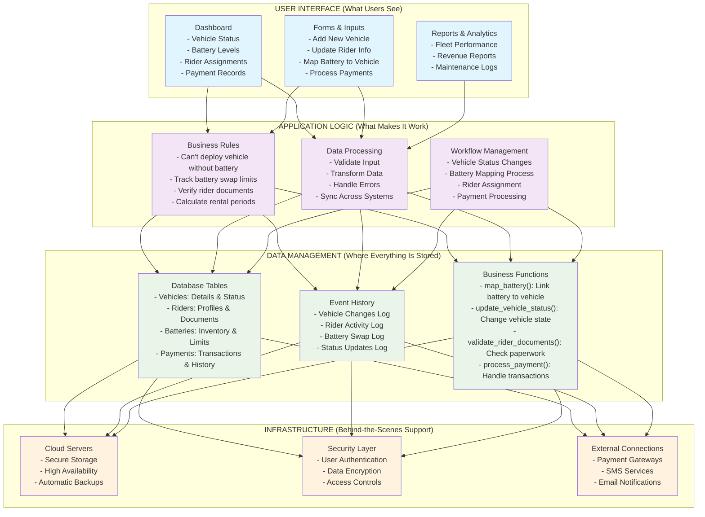

# Fleet Management Platform - Technical Architecture

## Overview

The Fleet Management Platform is a comprehensive solution designed for managing electric vehicle fleets, with particular focus on battery management, rider assignments, and vehicle tracking. The system enables businesses to efficiently operate electric vehicle rental services with sophisticated battery swapping capabilities.

## System Architecture Diagram

## Component Breakdown

### 1. USER INTERFACE (What Users See)
- **Dashboard**: The main screen showing vehicle status, battery levels, rider assignments, and payment records
- **Forms & Inputs**: Pages where users can add new vehicles, update rider information, map batteries to vehicles, and process payments
- **Reports & Analytics**: Sections that display fleet performance, revenue reports, and maintenance logs

### 2. APPLICATION LOGIC (What Makes It Work)
- **Business Rules**: The "common sense" rules that govern how the system works (e.g., a vehicle can't be deployed without a battery, tracking battery swap limits, verifying rider documents)
- **Data Processing**: The system that validates input, transforms data, handles errors, and keeps everything synchronized
- **Workflow Management**: The processes that handle vehicle status changes, battery mapping, rider assignments, and payment processing

### 3. DATA MANAGEMENT (Where Everything Is Stored)
- **Database Tables**: Organized storage areas for different types of information (vehicles, riders, batteries, payments)
- **Event History**: A complete log of all changes and activities in the system (vehicle changes, rider activity, battery swaps)
- **Business Functions**: Specialized operations that perform specific tasks (linking batteries to vehicles, updating vehicle status, validating documents, processing payments)

### 4. INFRASTRUCTURE (Behind-the-Scenes Support)
- **Cloud Servers**: Remote computers that securely store data, ensure high availability, and maintain automatic backups
- **Security Layer**: Protection mechanisms that authenticate users, encrypt data, and control access
- **External Connections**: Links to outside services for payments, SMS notifications, and email communications

## Key Features Explained

### Battery Management System
The platform includes a sophisticated battery management system that allows for:
- **Tracking of individual batteries**: Each battery has a unique ID so you can monitor it separately
- **Mapping batteries to specific vehicles**: The system knows which battery belongs to which vehicle
- **Managing battery swap limits**: Each battery has a monthly limit on how many times it can be swapped
- **Monitoring battery status**: Batteries can be Active (in use), Unmapped (available), or Mapped (assigned to a vehicle)

### Event Sourcing (Complete History Tracking)
The system keeps a complete record of all changes like a detailed diary:
- **Vehicle events**: Every change to vehicle status, battery assignments, and rider assignments is recorded
- **Rider events**: All rider status changes and vehicle assignments are logged
- **Audit trail**: Complete history of all operations for compliance and analytics - like a black box recorder

### Domain-Driven Design (Business-Focused Organization)
The application is organized around real business concepts:
- **Clear separation**: Different business areas (Vehicle, Rider, Battery) are kept separate but connected
- **Business rules**: Important rules are enforced automatically (like preventing deployment without a battery)
- **Consistent terms**: The same business terms are used throughout the application

### ERP-Grade Data Import (Bulk Operations)
The platform includes a sophisticated bulk data import system for large operations:
- **Template-based CSV import**: Download a template, fill it with data, upload it back
- **Comprehensive validation**: Checks all data before importing to prevent errors
- **Duplicate detection**: Finds and handles duplicate entries to avoid confusion
- **Step-by-step wizard**: Guides users through complex imports with multiple steps

## How Data Flows Through the System

1. **User Action**: Someone clicks a button or fills out a form in the user interface
2. **Business Logic Processing**: The system applies business rules (like checking if a vehicle has a battery before deployment)
3. **Data Validation**: Information is checked to make sure it's correct and complete
4. **Database Update**: Valid information is stored in the database
5. **Event Recording**: All changes are logged in the event history for tracking
6. **System Response**: Updated information is sent back to the user interface
7. **Display Update**: The screen refreshes to show the latest information

## Security & Access Control

- **Row Level Security (RLS)**: Like having different keys for different rooms - users only see data they're allowed to access
- **Authentication**: Secure login process verifies who users are before allowing access
- **Input Validation**: Multiple checks ensure that only valid data enters the system
- **Audit Logging**: All important operations are recorded for security monitoring and compliance

## Scalability Features (Growing With Your Business)

- **Real-time Updates**: Changes appear instantly across all devices and screens
- **Efficient Processing**: The system caches information to reduce load and speed up operations
- **Historical Data Management**: Past records are maintained without slowing down daily operations
- **Modular Design**: Different parts of the system can grow independently as your business expands